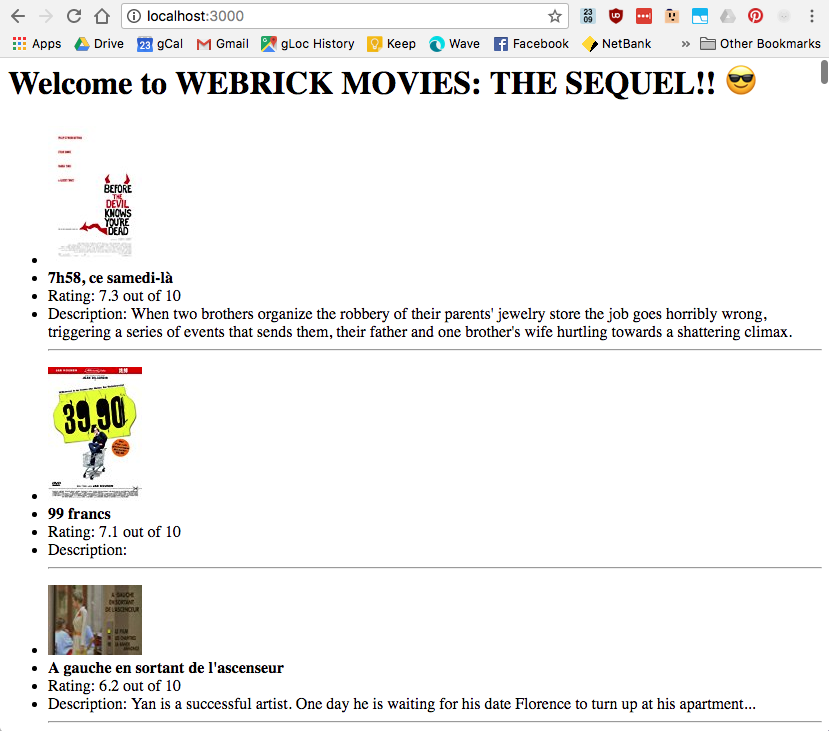

# CoderAcademy: 'Movies' - Sequel DB + Server + ERB



An exercise during my Coder Academy Bootcamp in 2018. This is my first time creating a WEBrick HTTPServlet, and properly using Sequel Models. Also my first time with ERB, so that was kinda neat.

Found the movies.json somewhere on google, it had a bunch of garbage, but it'll do!

## Getting Started

Clone the repo, and navigate to the directory in terminal. When you're there:

```bash
bundle install
```

once that's done, run the server using:

```bash
ruby main.rb
```

Then navigate to [http://localhost:3000] to check out the good stuff :)

### Prerequisites

- Ruby
- SQLite3
- Sequel

## License

This project is licensed under the MIT License - see the [LICENSE.md](LICENSE.md) file for details

## Acknowledgments

* Based off [Ruegen](https://github.com/Ruegen)'s initial code, thanks Ruegs!
* Written initially in pairs with [Mark](https://github.com/marktice/) - he pushed our [original version](https://github.com/marktice/webrick-movies) before I refactored a few things
